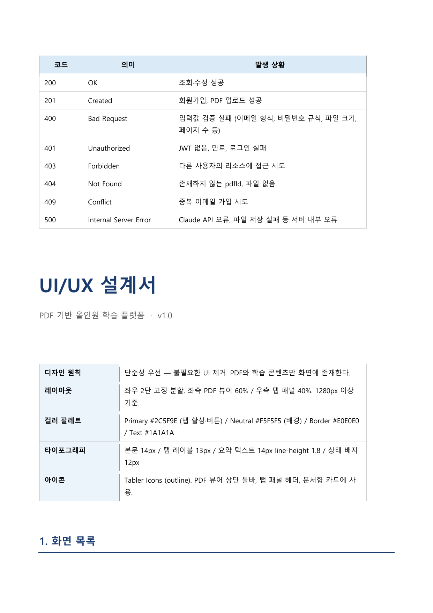
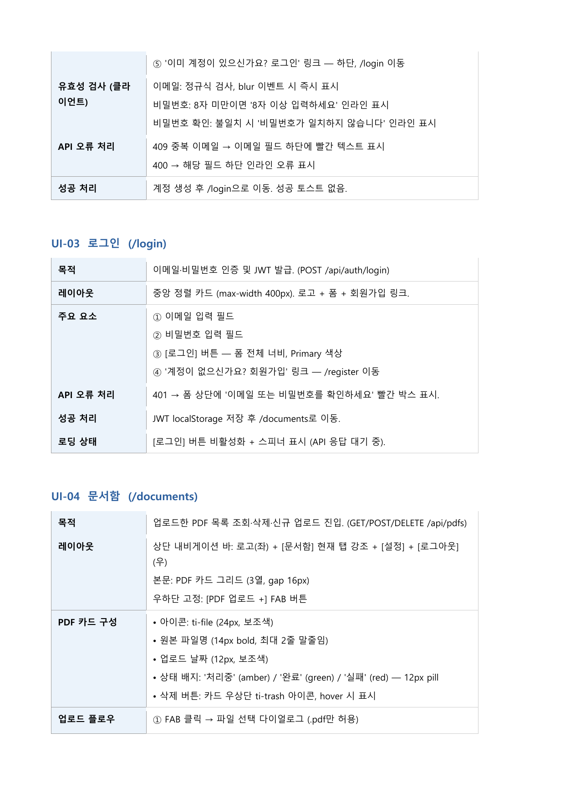
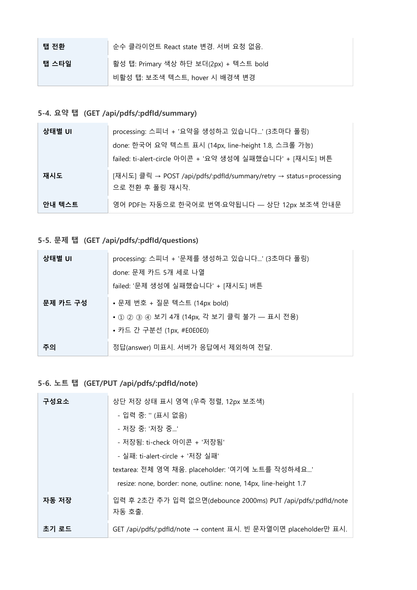
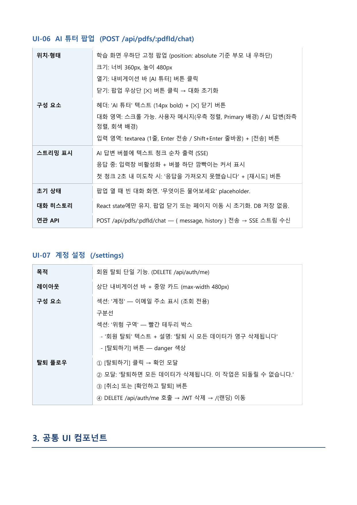
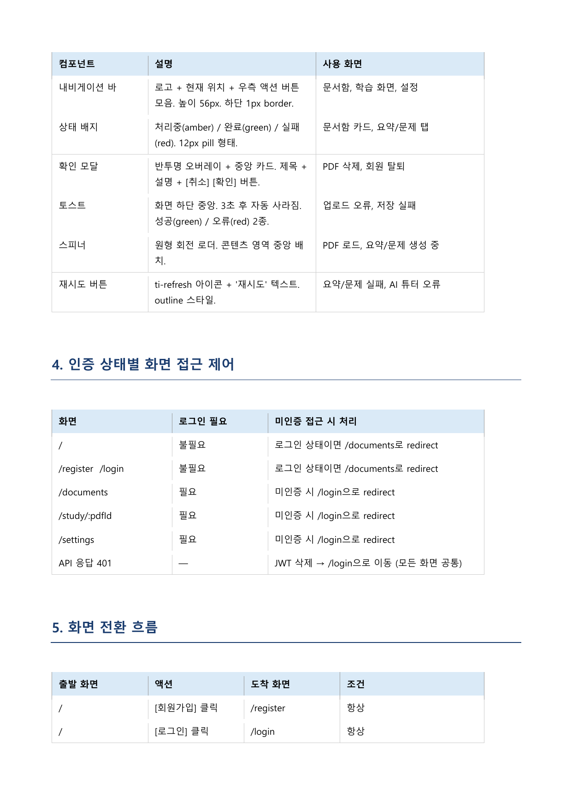
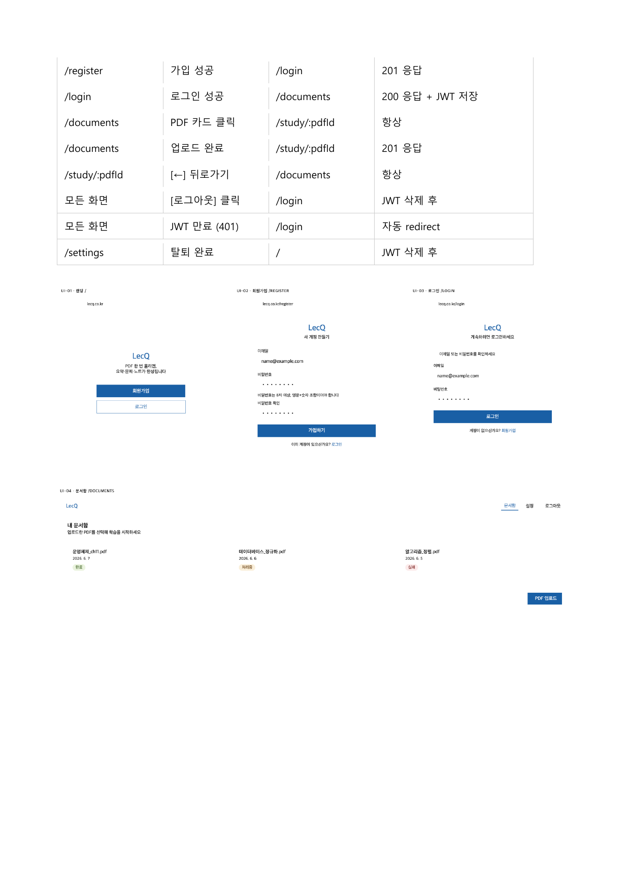
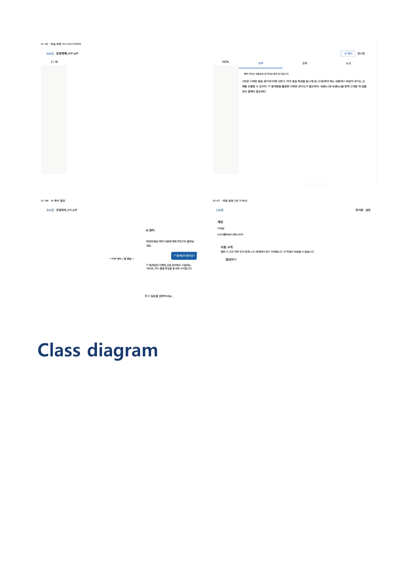

# LecQ - AI 교육 에이전트 팀플 프로젝트 요약

## 📌 프로젝트 개요

**프로젝트명**: LecQ - PDF 기반 올인원 학습 플랫폼
**팀명**: Team 2 (소프트웨어공학)
**작성일**: 2026년 6월
**팀원**: 심재현(24101944), 김영희(24101927), 김종빈(21102414)

---

## 🎯 프로젝트 목표

대학생들의 강의 슬라이드 PDF를 업로드하면, AI 튜터를 통해 학습을 지원하는 플랫폼을 개발합니다.

**핵심 기능**:
- PDF 1페이지 업로드 → 요약, 문제, 노트 자동 생성
- Claude API 기반 한국어 요약 및 문제 생성
- AI 튜터를 통한 학습 지원 (SSE 스트리밍)
- 사용자별 PDF 관리 및 학습 기록

---

## 📋 시스템 요구사항

| 항목 | 내용 |
|------|------|
| **서비스 유형** | 웹 브라우저 기반 (데스크탑 1280px 이상) |
| **기술 스택** | React, Node.js/Express, SQLite(개발)/PostgreSQL(배포), Claude API |
| **대상 사용자** | 강의자료 PDF를 학습하는 대학생 |
| **핵심 목표** | PDF 1페이 업로드 → 요약, 문제, 노트 자동 생성 |
| **AI 연동** | Claude API (claude-sonnet-4-20250514) |

### 화면 구조

```
최좌 PDF 뷰이 (60%) + 우측 팀 패널 (40%) : 요약 탭 / 문제 탭 / 노트 탭 / AI 튜터 탐업
```

---

## 🏗️ 도메인 설계

### 1. User (사용자)
- **userId**: 사용자 고유 식별자 (PK, AUTO INCREMENT)
- **email**: 로그인 ID (UNIQUE)
- **passwordHash**: bcrypt 해싱된 비밀번호
- **createdAt**: 계정 생성 일시
- **관계**: User 1 ↔ N PDF (1:N)

### 2. PDF (문서)
- **pdfId**: PDF 고유 식별자 (PK)
- **userId**: 사용자 외래키 (FK)
- **originalName**: 원본 파일명
- **storedName**: 서버 저장 파일명 (UUID 형식)
- **extractedText**: PDF에서 추출한 텍스트
- **pageCount**: 총 페이지 수
- **createdAt**: 업로드 일시
- **관계**: PDF 1 ↔ 1 Summary, PDF 1 ↔ 1 Questions, PDF 1 ↔ 1 Note

### 3. Summary (요약)
- **summaryId**: 요약 고유 식별자 (PK)
- **pdfId**: PDF 외래키 (FK)
- **content**: Claude API로 생성된 한국어 요약 텍스트
- **status**: 'processing' / 'done' / 'failed' (기본값: processing)
- **createdAt**: 생성 일시

### 4. Questions (문제)
- **questionId**: 문제 고유 식별자 (PK)
- **pdfId**: PDF 외래키 (FK)
- **content**: Claude API로 생성된 객관식 문제 (JSON 형식)
- **status**: 'processing' / 'done' / 'failed'
- **createdAt**: 생성 일시

### 5. Note (노트)
- **noteId**: 노트 고유 식별자 (PK)
- **pdfId**: PDF 외래키 (FK)
- **content**: 사용자가 직접 작성한 텍스트
- **updatedAt**: 마지막 수정 일시

---

## 🔌 주요 기능 요구사항 (FR)

### 기능 요구사항 (FR-01 ~ FR-13)

#### **FR-01: 회원가입**
- 이메일과 비밀번호로 계정 생성
- 비밀번호는 bcrypt(salt rounds=10)로 해싱
- 성공 시: /login으로 이동

#### **FR-02: 로그인**
- JWT(24시간) 발급 → localStorage 저장
- 성공 시: /documents로 이동
- 실패 시: 비밀번호 불일치 메시지

#### **FR-03: 로그아웃**
- localStorage의 JWT 삭제
- /login으로 이동

#### **FR-04: 회원 탈퇴**
- 사용자의 모든 데이터 삭제 (CASCADE)
- ON DELETE CASCADE로 pdfs/summaries/questions/notes 자동 삭제

#### **FR-05: PDF 업로드**
- 파일 선택 → multipart/form-data로 POST /api/pdfs
- 파일 제한: 20MB 이하, 페이지 50 이하
- pdf-parse로 텍스트 추출 → DB 저장
- Promise.all로 3가지 작업 병렬 실행:
  1. extracted_text 기반 요약 생성
  2. extracted_text 기반 문제 5개 생성
  3. 빈 노트 레코드 생성

#### **FR-06: PDF 문서 조회**
- GET /api/pdfs → 사용자의 모든 PDF 목록
- 생성일순(DESC)으로 정렬

#### **FR-07: PDF 삭제**
- DELETE /api/pdfs/:pdfId
- ON DELETE CASCADE로 관련 요약/문제/노트 자동 삭제

#### **FR-08: PDF 뷰어**
- react-pdf로 PDF 렌더링 (디스트 라이브러리)
- 좌측 60% 영역에 PDF 표시

#### **FR-09: 탭 패널 전환**
- 우측 40% 영역에 탭 패널 (요약, 문제, 노트, AI 튜터)
- 기본 탭: 요약

#### **FR-10: 요약 탭 조회**
- GET /api/pdfs/:pdfId/summary
- status = 'done' → 한국어 요약 텍스트 표시
- 영어 PDF는 자동으로 한국어 번역

#### **FR-11: 문제 탭 조회**
- GET /api/pdfs/:pdfId/questions
- Claude API로 생성된 4선지 객관식 문제 5개
- 정답은 DB에 저장, 사용자 선택 시 검증

#### **FR-12: 노트 탭 작성/수정**
- GET /api/pdfs/:pdfId/note → 노트 조회
- PUT /api/pdfs/:pdfId/note → 노트 수정 (debounce 2000ms)
- placeholder: '여기에 노트를 작성하세요...'

#### **FR-13: AI 튜터 (담임)**
- POST /api/pdfs/:pdfId/chat (SSE 스트리밍)
- 입력: { message, history: [] }
- System 프롬프트: 8000자 extracted_text + 학습 관련 질문 담당
- Claude API stream: true 사용
- 대화 히스토리는 세션 메모리 유지 (DB 저장 X)

---

## 📊 비즈니스 규칙 (BR)

| 규칙 ID | 설명 | 처리 방법 |
|---------|------|---------|
| **BR-01** | 사용자는 이메일 1개당 계정 1개 생성 가능 | UNIQUE 제약조건 |
| **BR-02** | 비밀번호는 8자 이상, 영문+숫자 필수 | 입력 유효성 검사 |
| **BR-03** | 업로드된 PDF는 텍스트 레이어가 있어야 함 | OCR은 지원하지 않음 |
| **BR-04** | PDF는 20MB 이하, 50페이지 이하 | 업로드 제약 |
| **BR-05** | 요약/문제 생성 시 사용자 승인 필요 | 자동 생성 지원 |
| **BR-06** | 요약/문제는 PDF 1개당 1세트 | UNIQUE 제약 |
| **BR-07** | 요약 생성 실패 시 Claude API 재호출 불가 | status='failed' 표시 |
| **BR-08** | 노트는 PDF에 종속 | CASCADE 삭제 |
| **BR-09** | AI 튜터는 대화만 지원, 파일 이동 지원 X | 세션 메모리 유지 |
| **BR-10** | JWT 만료 시 모든 API 요청 401 반환 | /login으로 redirect |
| **BR-11** | 영어 PDF는 Claude에게 번역+요약 | 한국어 요약 필수 |

---

## 🎨 UI/UX 설계

### 디자인 원칙
- **단순성**: 우산 - 불필요한 UI 제거, PDF와 학습 콘텐츠 집중
- **레이아웃**: 좌우 2단 고정 분할. 좌측 PDF 뷰어 60% / 우측 탭 패널 40% (1280px 이상)
- **색상팔레트**: Primary #2C5F9E (팀 활성), Neutral #F5F5F5 (배경) / Border #E0E0E0
- **타이포그래피**: 본문 14px / 팀 레이블 13px / 요약 텍스트 14px line-height 1.8

### 주요 화면

#### **UI-01: 랜딩 페이지 (/)**
- 목적: 서비스 소개 및 회원가입 유도
- 레이아웃: 중앙 정렬 단일 컬럼, 로고 + 서비스 문구 설명 + 버튼 2개
- 주요 요소:
  1. 서비스명 'LecQ' (상단 중앙, 28px bold)
  2. 설명 문구 (16px)
  3. [회원가입] 버튼 (Primary), [로그인] 버튼 (Outline)
- 상태: 비로그인 사용자 접근 가능, 로그인 상태면 /documents로 redirect

#### **UI-02: 회원가입 (/register)**
- 목적: 이메일/비밀번호로 계정 생성
- 레이아웃: 중앙 정렬 카드 (max-width 400px)
- 주요 요소:
  1. 이메일 입력 필드 (placeholder: 'name@example.com')
  2. 비밀번호 입력 필드 (type=password, placeholder: '8자 이상, 영문+숫자')
  3. 비밀번호 확인 필드 (type=password, placeholder: '비밀번호 재입력')
  4. [가입하기] 버튼 (Primary)
- 유효성 검사 (클라이언트):
  - 이메일: 정규식 검사, blur 이벤트 시 즉시 표시
  - 비밀번호: 8자 미만이면 '8자 이상 입력하세요' 표시
  - 비밀번호 확인: 불일치 → '비밀번호 재입력' 표시
- API 오류 처리:
  - 409 중복 이메일 → '이메일 중복' 경고
  - 400 → 입력값 오류 표시

#### **UI-03: 로그인 (/login)**
- 목적: 이메일/비밀번호 인증 및 JWT 발급
- 레이아웃: 중앙 정렬 카드 (max-width 400px)
- 주요 요소:
  1. 이메일 입력 필드
  2. 비밀번호 입력 필드
  3. [로그인] 버튼 (Primary)
  4. '계정이 없으신가요? 회원가입 링크' → /register 이동
- API 오류 처리:
  - 401 → '이메일 또는 비밀번호를 확인하세요' 경고
- 성공 처리: JWT localStorage 저장 후 /documents로 이동

#### **UI-04: 문서함 (/documents)**
- 목적: 업로드된 PDF 목록 조회 및 관리
- 레이아웃: 상단 내비게이션 바 + 하단 컨텐츠 2단 (업로드 영역 + FAB 버튼 + 문서 카드 그리드)
- PDF 카드 구성:
  - 아이콘: ti-file (24px, 보조색)
  - 원본 파일명 (14px bold)
  - 업로드 날짜 (12px, 보조색)
  - 삭제 버튼 (ti-trash 아이콘, hover시 표시)
- 업로드 플로우:
  1. FAB 클릭 → 파일 선택 다이얼로그 표시 (.pdfm 선택 가능)
  2. 클라이언트가 파일 검증 (20MB, 50페이지 초과 확인)
  3. multipart/form-data로 POST /api/pdfs
  4. 파일 업로드 중 스피너 + '업로드 중...' 표시
- 목록 정렬: 최신순 (created_at DESC)

#### **UI-05: 학습 화면 (/study/:pdfId)**
- 전체 레이아웃: 상단 내비게이션 바 + 하단 2단 (좌측 PDF 뷰어 60% + 우측 탭 패널 40%)

**5-1. 상단 네비게이션 바**
- 구성요소:
  - 좌: [-] 뒤로가기 버튼 + 현재 PDF 파일명 (16px bold, 최대 30자 말줄임)
  - 우: [AI 튜터] 버튼 (Primary) + [문서함] 링크 + [설정] [로그아웃]
- 연관 API: 없음 (네비게이션 바)

**5-2. 좌측 — PDF 뷰어 (너비 60%)**
- 연관 API: GET /api/pdfs/:pdfId/file
- 구성요소:
  - [←] [→] 페이지 이동 버튼
  - 현재 페이지 / 전체 페이지 수 (16px bold)
  - 업로드 고정: [PDF 업로드 +] FAB 버튼
  - 상태 처리: 로딩 중 '파일을 불러오지 못했습니다' + [새로 고침] 버튼
  - 제외 기능: 텍스트 선택, 하이라이트, 북마크 없음

**5-3. 우측 — 탭 패널 (너비 40%)**

**탭 구성**
- [요약] (문제) [노트 탭] [AI 튜터 탐업(선택형 고정)]
- 기본 탭: 요약

**5-4. 요약 탭 (GET /api/pdfs/:pdfId/summary)**
- 상태별 UI:
  - processing: 스피너 + '요약을 생성하고 있습니다.' (3초마다 물림)
  - done: 한국어 요약 텍스트 표시 (14px, line-height 1.8, 스크롤 가능)
  - failed: ti-alert-circle 아이콘 + '요약 생성에 실패했습니다' + [재시도] 버튼
- 재시도 로직: 스피너 → POST /api/pdfs/:pdfId/summary/retry → status=processing으로 전환 후 풀링

**5-5. 문제 탭 (GET /api/pdfs/:pdfId/questions)**
- 상태별 UI:
  - processing: 스피너 + '문제를 생성하고 있습니다.' (3초마다 물림)
  - done: 문제 카드 5개 세로 나열
  - failed: '문제 생성에 실패했습니다' + [재시도] 버튼
- 문제 카드 구성:
  - 문제 번호 + 질문 텍스트 (14px bold)
  - ① ② ③ ④ 보기 4개 (14px)
  - 카드 간 구분선 (1px, #E0E0E0)
- 주의: 정답(answer) 미표시. 사용자가 응답 시 검증

**5-6. 노트 탭 (GET/PUT /api/pdfs/:pdfId/note)**
- 구성요소:
  - 상단 저장 상태 표시 영역 (우측 정렬, 12px 보조색)
    - 입력 중: '저장 중...' 표시
    - 자동 저장: '저장됨' 표시
  - 구분선
  - 텍스트 입력 영역 (다중 행, resize: none, border: none, outline: none, 14px, line-height 1.7)
    - placeholder: '여기에 노트를 작성하세요...'
- 자동 저장: 입력 후 2초 주기 debounce → PUT /api/pdfs/:pdfId/note 자동 호출
- 초기 로드: GET /api/pdfs/:pdfId/note → content 표시, 빈 문자열이면 placeholder 표시

#### **UI-06: AI 튜터 탐업 (POST /api/pdfs/:pdfId/chat)**
- 위치/형태: 좌측 우측 고정 팝업 (position: absolute 기준 부모 내 우측)
- 크기: 너비 360px, 높이 480px
- 열기: 네비 탭의 탭 결과 클릭
- 단기: 임금 우상단 [X] 버튼 클릭 → 대화 히스토리 세션에서 유지
- 구성 요소:
  - 헤더: 'AI 튜터' 텍스트 (14px bold) + [X] 닫기 버튼
  - 대화 영역: 스크롤 가능, 사용자 메시지 (우측 정렬, Primary 배경) / AI 응답 (좌측 정렬, 중립 배경)
  - 임력 영역: textarea (1줄, Enter 전송 / Shift+Enter 줄바꿈) + 전송 버튼
  - 스트리밍 표시: AI 답변 브라우저에서 텍스트 청크 추출 정기(SSE)
- 응답 처리:
  - API 오류: '응금을 가져오지 못했습니다' + [재시도] 버튼
  - 스트리밍: data: { chunk } 형식으로 수신

#### **UI-07: 계정 설정 (/settings)**
- 목적: 회원 탈퇴 단일 기능
- 레이아웃: 상단 내비게이션 바 + 중앙 카드 (max-width 480px)
- 구성 요소:
  - 섹션: '계정'
  - 구분선
  - 섹션: '위험 구역'
    - 섹션: '위험 구역'
    - 위험 구역 구역: '탈퇴하면 모든 데이터가 삭제됩니다'
    - [탈퇴하기] 버튼 (danger 색상)
- 탈퇴 플로우:
  1. [탈퇴하기] → 확인 다이얼로그 표시
  2. 확인 → DELETE /api/auth/me 호출
  3. 성공 → JWT 삭제 → /login으로 redirect

---

## 🌐 API 엔드포인트 설계

### 공통 규칙
- **Base URL**: http://localhost:4000/api
- **인증**: Authorization: Bearer {JWT} (Authorization 헤더 필수)
- **Content-Type**: application/json (또는 multipart/form-data)
- **오류 응답**: { "error": "오류 메시지" }
- **성공 응답**: { "data": { ... } } 또는 { "data": [ ... ] }

### 전체 엔드포인트 목록

| Method | Path | 인증 | 설명 | 요청 Body | 응답 (200) |
|--------|------|------|------|----------|-----------|
| **POST** | /api/auth/register | 불필요 | 회원가입 | {email, password} | {userId, email} |
| **POST** | /api/auth/login | 불필요 | 로그인 | {email, password} | {token} |
| **DELETE** | /api/auth/me | 필요 | 회원 탈퇴 | - | {message} |
| **POST** | /api/pdfs | 필요 | PDF 업로드 | multipart: file | {pdfId, originalName, status} |
| **GET** | /api/pdfs | 필요 | 문서함 조회 | - | [{pdfId, originalName, createdAt, summaryStatus, questionsStatus}] |
| **DELETE** | /api/pdfs/:pdfId | 필요 | PDF 삭제 | - | {message} |
| **GET** | /api/pdfs/:pdfId/file | 필요 | PDF 파일 반환 | - | application/pdf 스트림 |
| **GET** | /api/pdfs/:pdfId/summary | 필요 | 요약 조회 | - | {status, content} |
| **POST** | /api/pdfs/:pdfId/summary/retry | 필요 | 요약 재생성 | - | {status} |
| **GET** | /api/pdfs/:pdfId/questions | 필요 | 문제 조회 | - | {status, content:[{question,options}]} |
| **POST** | /api/pdfs/:pdfId/questions/retry | 필요 | 문제 재생성 | - | {status} |
| **GET** | /api/pdfs/:pdfId/note | 필요 | 노트 조회 | - | {content, updatedAt} |
| **PUT** | /api/pdfs/:pdfId/note | 필요 | 노트 저장 | {content} | {updatedAt} |
| **POST** | /api/pdfs/:pdfId/chat | 필요 | AI 튜터 (SSE) | {message, history:[]} | SSE 스트림 |

### 상세 엔드포인트 설명

#### **3.1 인증 (Auth)**

**POST /api/auth/register — 회원가입**
- 설명: 이메일/비밀번호로 신규 계정 생성
- Request Body: { "email": "user@example.com", "password": "abc12345" }
- Response 201: { "data": { "userId": 1, "email": "user@example.com" } }
- 오류:
  - 480: 이메일 정규식 오류 / 비밀번호 규칙 미충족 / 비밀번호 루치 미충족
  - 489: 중복 이메일

**POST /api/auth/login — 로그인**
- 설명: 이메일/비밀번호로 검증 후 JWT 발급
- Request Body: { "email": "user@example.com", "password": "abc12345" }
- Response 200: { "data": { "token": "eyJhbGci..." } }
- 오류:
  - 401: 이메일 미존재 또는 비밀번호 불일치 → '이메일 또는 비밀번호를 확인하세요' 표시

**DELETE /api/auth/me — 회원 탈퇴**
- 설명: 로그인된 사용자의 계정 및 모든 데이터 삭제
- Request Body: 없음
- Response 200: { "data": { "message": "탈퇴가 완료되었습니다" } }
- 처리 순서: ① users 레코드 삭제 (CASCADE) → ② /uploads/{userid}/ 디렉토리 삭제

#### **3.2 PDF 관리**

**POST /api/pdfs — PDF 업로드**
- 설명: PDF 파일을 업로드하고 요약/문제 노트 자동 생성
- Request: multipart/form-data. 필드명: file
- 서버 처리 순서:
  ① multer → /uploads/{userId}/{uuid}.pdf 저장
  ② pdf-parse → extractedText 추출 → pdfs 테이블에 저장
  ③ 페이지 수 검증 (≤50)
  ④ Promise.all로 3가지 작업 병렬 실행:
    ⓐ Claude API 호출 → 요약 생성 → summaries 테이블 저장 (status: processing → done)
    ⓑ Claude API 호출 → 문제 5개 생성 → questions 테이블 저장 (JSON 문제 포함)
    ⓒ 빈 노트 레코드 생성
- Response 201: { "data": { "pdfId": 7, "originalName": "운영체계.pdf", "summaryStatus": "processing", "questionsStatus": "processing" } }
- 오류:
  - 480: .pdf 아닌 파일 / 20MB 초과 / 50페이지 초과
  - 401: JWT 없음·만료
- 이미지: img/upload_flow.png

**GET /api/pdfs — 문서함 조회**
- 설명: 로그인된 사용자의 PDF 목록 조회 (최신순)
- Request: 없음 (JWT필수)
- Response 200: { "data": [ { "pdfId": 7, "originalName": "운영체계.pdf", "createdAt": "2026-06-07T10:00:00Z", "summaryStatus": "done", "questionsStatus": "done" } ] }
- 빈 목록: { "data": [] } → 클라이언트가 빈 상태 표시

#### **3.3 학습 콘텐츠**

**GET /api/pdfs/:pdfId/summary — 요약 조회**
- 설명: 해당 PDF의 요약 상태와 내용을 반환
- Response 200 (done): { "data": { "status": "done", "content": "여 운영체제는..." } }
- Response 200 (processing): { "data": { "status": "processing", "content": null } }
- Response 200 (failed): { "data": { "status": "failed", "content": null } }
- 플라이언트 처리: status=processing → 3초마다 물림. status=done → 내용 표시. status=failed → 재시도 버튼

**POST /api/pdfs/:pdfId/summary/retry — 요약 재생성**
- 설명: status=failed인 요약을 재생성
- Request Body: 없음
- Response 200: { "data": { "status": "processing" } }
- 오류: 400: status=done인 경우 재생성 불가

**GET /api/pdfs/:pdfId/questions — 문제 조회**
- 설명: 해당 PDF의 문제 상태와 내용을 반환. 정답(answer)은 숨금 비율
- Response 200 (done): { "data": { "status": "done", "content": [ { "question": "운영체제의 역할은 ?, "options": ["답 A","② B","③ C","④ D"], "answer": 0 } ] } }
- 주의: answer 필드는 DB에 저장하지만 클라이언트에 응답하기 전에 제거

**POST /api/pdfs/:pdfId/questions/retry — 문제 재생성**
- 설명: status=failed인 문제를 재생성
- Response 200: { "data": { "status": "processing" } }

**GET /api/pdfs/:pdfId/note — 노트 조회**
- 설명: 해당 PDF에 종속된 노트를 조회
- Response 200: { "data": { "content": "여기에 노트를 작성하세요...", "updatedAt": "2026-06-07T11:00:00Z" } }
- 초기 상태: content="" (빈 문자열). 클라이언트가 placeholder 표시

**PUT /api/pdfs/:pdfId/note — 노트 저장**
- 설명: 노트 내용을 저장. 클라이언트는 debounce 2000ms 후 자동 호출
- Request Body: { "content": "자사자가 임력한 텍스트..." }
- Response 200: { "data": { "updatedAt": "2026-06-07T11:05:00Z" } }

#### **3.4 AI 튜터**

**POST /api/pdfs/:pdfId/chat — AI 튜터 채팅 (SSE 스트리밍)**
- 설명: PDF 콘텍스트를 기반으로 사용자 질문에 Claude API가 스트리밍 응답
- Request Body: { "message": "운영체제란 무엇인가?", "history": [ { "role": "user", "content": "이전 질문" }, { "role": "assistant", "content": "이전 답변" } ] }
- 서버 처리:
  ① pdfs.extracted_text 및 8000자 System 프롬프트에 입력
  ② 기존 대화 history.messages 배열로 구성
  ③ Claude API (stream: true) 호출
  ④ 응답 청크를 SSE(Server-Sent Events)로 클라이언트에 전송
  ⑤ 응답 완료 시 [DONE]
- Response Content-Type: text/event-stream
- SSE 형식:
  ```
  data: {"chunk": "운영체제의"}
  data: {"chunk": " 역할은"}
  data: [DONE]
  ```
- 오류:
  - 500: Claude API 오류 → data: {"error": "응급을 가져오지 못했습니다"}
- 주의: 대화 히스토리는 클라이언트 React state에만 유지 (DB 저장 X)

#### **4. HTTP 상태 코드 정리**

| 코드 | 의미 | 발생 상황 |
|------|------|---------|
| 200 | OK | 조회·수정 성공 |
| 201 | Created | 회원가입, PDF 업로드 성공 |
| 400 | Bad Request | 입력값 검증 실패 (이메일 형식, 비밀번호 규칙, 파일 크기 등) |
| 401 | Unauthorized | JWT 없음·만료 |
| 403 | Forbidden | 다른 사용자의 리소스에 접근 시도 |
| 404 | Not Found | 존재하지 않는 pdfId, 파일 없음 |
| 409 | Conflict | 중복 이메일 가입 |
| 500 | Internal Server Error | Claude API 오류, 파일 저장 실패 등 서버 내부 오류 |

---

## 🗂️ 도메인 명세서

### 1. 도메인 개요

본 시스템은 대학생의 강의 자료 PDF를 업로드하면, AI 튜터를 통해 학습을 지원하는 교육 플랫폼입니다. 핵심 도메인은 4가지 영역으로 구성:

| 도메인 영역 | 설명 | 포함 개념 |
|-----------|------|---------|
| **회원 관리** | 사용자 계정 생성, 로그인, 탈퇴 | User, 인증/인가 정책 |
| **PDF 관리** | PDF 업로드, 조회, 삭제 | PDF, 파일 저장소 |
| **학습 콘텐츠** | 자동 생성 요약, 문제, 노트 | Summary, Questions, Note |
| **AI 연동** | Claude API 기반 요약/문제 생성, AI 튜터 | Claude API, SSE 스트리밍 |

### 2. 도메인 개념 사전

| 용어 | 정의 | 비고 |
|------|------|------|
| **User (사용자)** | 이메일·비밀번호로 가입한 서비스 이용자 | 비로그인 사용자는 User가 아님 |
| **PDF** | 사용자가 업로드한 강의 자료 PDF 파일 | .pdf 확장자, 20MB·50페이지 제한 |
| **extracted_text** | pdf-parse로 추출한 PDF 전체 텍스트 | DB에 저장, AI 튜터 기반 자료 |
| **Summary (요약)** | Claude API가 생성한 한국어 요약 텍스트 | status: processing / done / failed 3가지 |
| **Question (문제)** | Claude API가 생성한 4선지 객관식 문제 | JSON 문제 집합. 정답은 숨김 |
| **Note (노트)** | 사용자가 직접 작성한 학습 노트 | debounce 2000ms로 자동 저장 |
| **Study Session (학습 세션)** | PDF 뷰어 + 탭 패널 + AI 튜터 UI | 통합 학습 인터페이스 |
| **AI 튜터** | Claude API 기반 실시간 대화 지원 | SSE 스트리밍, 히스토리는 세션 메모리 |
| **JWT** | 로그인 후 발급하는 인증 토큰 | 24시간 만료 |
| **status** | 요약/문제/노트의 생성 상태 | processing / done / failed / (노트는 없음) |
| **debounce** | 입력 후 일정 시간 후 자동 실행 | 노트 저장 시 2000ms |
| **SSE (Server-Sent Events)** | AI 튜터 응답 실시간 스트리밍 | WebSocket 대신 단방향 스트림 사용 |

### 3. 도메인 객체 명세

각 도메인 객체의 속성, 타입, 제약조건, 설명

#### **3.1 User**
| 속성명 | 타입 | 제약 조건 | 설명 |
|--------|------|---------|------|
| userId | INTEGER | PK, AUTO INCREMENT | 사용자 고유 식별자 |
| email | VARCHAR(255) | UNIQUE, NOT NULL, 정규 검증 | 로그인 ID. 중복 불가 |
| passwordHash | VARCHAR(255) | NOT NULL | bcrypt(salt=10) 해싱. 평문 저장 금지 |
| createdAt | DATETIME | NOT NULL, DEFAULT NOW() | 계정 생성 일시 |

- 연관 관계: User 1 ↔ N PDF (userId FK)
- 삭제 정책: users 레코드 삭제 시 ON DELETE CASCADE로 해당 사용자의 모든 PDF 요약/문제/노트 삭제

#### **3.2 PDF**
| 속성명 | 타입 | 제약 조건 | 설명 |
|--------|------|---------|------|
| pdfId | INTEGER | PK, AUTO INCREMENT | PDF 고유 식별자 |
| userId | INTEGER | FK → users.userId, NOT NULL | 소유 사용자 |
| originalName | VARCHAR(255) | NOT NULL | 업로드 시 원본 파일명 |
| storedName | VARCHAR(255) | NOT NULL, UUID 형식 | 서버 저장 파일명 (/uploads/{userId}/{uuid}.pdf) |
| extractedText | TEXT | NULLABLE | pdf-parse 추출 텍스트. 이미지 PDF는 NULL |
| pageCount | INTEGER | NOT NULL | 총 페이지 수. 최대 50 |
| createdAt | DATETIME | NOT NULL, DEFAULT NOW() | 업로드 일시 |

- 연관 관계: PDF 1 ↔ 1 Summary, PDF 1 ↔ 1 Questions, PDF 1 ↔ 1 Note
- 삭제 정책: pdfs 레코드 삭제 시 ON DELETE CASCADE로 요약/문제/노트 자동 삭제. 서버 파일도 삭제

#### **3.3 Summary (요약)**
| 속성명 | 타입 | 제약 조건 | 설명 |
|--------|------|---------|------|
| summaryId | INTEGER | PK, AUTO INCREMENT | 요약 고유 식별자 |
| pdfId | INTEGER | FK → pdfs.pdfId, UNIQUE, NOT NULL | 연결된 PDF. 1:1 관계 |
| content | TEXT | NULLABLE | 생성된 한국어 요약 텍스트. status=done일 때만 채워짐 |
| status | VARCHAR(20) | NOT NULL, DEFAULT 'processing' | processing / done / failed 3가지 |
| createdAt | DATETIME | NOT NULL, DEFAULT NOW() | 생성 요약 일시 |

- 생성 시점: PDF 업로드 직후 (Promise.all의 ① 작업)
- 언어 처리: 영어 PDF는 번역+요약을 Claude API에 요청 (한국어 요약 필수)
- 재생성: status='failed' → POST /api/pdfs/:pdfId/summary/retry 호출 → status='processing' 재설정

#### **3.4 Questions (문제)**
| 속성명 | 타입 | 제약 조건 | 설명 |
|--------|------|---------|------|
| questionId | INTEGER | PK, AUTO INCREMENT | 문제 고유 식별자 |
| pdfId | INTEGER | FK → pdfs.pdfId, UNIQUE, NOT NULL | 연결된 PDF. 1:1 관계 |
| content | TEXT | NULLABLE | JSON 문제 집합. [{"question":"", "options":["①","②","③","④"], "answer":0}] × 5개 |
| status | VARCHAR(20) | NOT NULL, DEFAULT 'processing' | processing / done / failed |
| createdAt | DATETIME | NOT NULL, DEFAULT NOW() | 생성 요약 일시 |

- JSON 구조: [{"question":"문제", "options":["①","②","③","④"], "answer":0~3}] (answer는 DB만 저장, 클라이언트 숨김)
- answer: 정답 보기 인덱스(0~3). DB에는 저장하지만 API 응답 시 제거
- 파싱 실패 시: status='failed' 표시 → [재시도]

#### **3.5 Note (노트)**
| 속성명 | 타입 | 제약 조건 | 설명 |
|--------|------|---------|------|
| noteId | INTEGER | PK, AUTO INCREMENT | 노트 고유 식별자 |
| pdfId | INTEGER | FK → pdfs.pdfId, UNIQUE, NOT NULL | 연결된 PDF. 1:1 관계 |
| content | TEXT | NOT NULL, DEFAULT "" | 사용자가 직접 작성한 자유 텍스트. 초기값 빈 문자열 |
| updatedAt | DATETIME | NOT NULL, DEFAULT NOW() | 마지막 수정 일시 |

- 생성 시점: PDF 업로드 직후 (Promise.all의 ③ 작업)
- 초기값: 빈 문자열 (NULL 아님)
- 자동 저장: 클라이언트 debounce(2000ms) 후 PUT /api/pdfs/:pdfId/note 호출

---

## 💾 ERD (Entity-Relationship Diagram)

```
사용자 도메인 (User)
  - userId (PK)
  - email (UK)
  - passwordHash
  - createdAt

    ↓ 1:N

PDF 도메인 (PDF)
  - pdfId (PK)
  - userId (FK)
  - originalName
  - storedName
  - extractedText
  - pageCount
  - createdAt

    ↓ 1:1 (각각)

  Summary (요약)        Questions (문제)      Note (노트)
  - summaryId (PK)     - questionId (PK)    - noteId (PK)
  - pdfId (FK, UK)     - pdfId (FK, UK)     - pdfId (FK, UK)
  - content            - content            - content
  - status             - status             - updatedAt
  - createdAt          - createdAt
```

---

## 📸 주요 다이어그램

### Use Case Diagram (페이지 36)


### Class Diagram (페이지 38)


### Sequence Diagrams

#### SD-01: 로그인 (페이지 40)


#### SD-02: PDF 업로드 (Promise.all) (페이지 41)


#### SD-03: 요약 조회 (페이지 42)


#### SD-04: 노트 자동 저장 (Debounce) (페이지 43)


#### SD-05: AI 튜터 채팅 (SSE 스트리밍) (페이지 44)


### 추가 다이어그램
- 페이지 37: UI 프로토타입 예시
- 페이지 45-49: ERD, 데이터 흐름도

---

## 📑 이미지 인덱스

| 페이지 | 내용 |
|--------|------|
| page-01.png | 표지 |
| page-02.png | 목차 |
| page-03~04.png | 팀 소개 & 개요 |
| page-05~09.png | 개요 & 문제 정의 |
| page-10~13.png | 요구사항 명세서 (기능 요구사항) |
| page-14~22.png | 요구사항 명세서 (비기능 요구사항) |
| page-23~25.png | 도메인 명세서 & 비즈니스 규칙 |
| page-26~35.png | UI/UX 설계 (전체 화면) |
| page-36.png | **Use Case Diagram** ⭐ |
| page-37.png | UI 프로토타입 |
| page-38.png | **Class Diagram (ERD)** ⭐ |
| page-39.png | Sequence Diagram 개요 |
| page-40.png | **SD-01: 로그인** ⭐ |
| page-41.png | **SD-02: PDF 업로드** ⭐ |
| page-42.png | **SD-03: 요약 조회** ⭐ |
| page-43.png | **SD-04: 노트 저장** ⭐ |
| page-44.png | **SD-05: AI 튜터** ⭐ |
| page-45~49.png | API 명세서 |

---

## 🔧 기술 스택

| 계층 | 기술 | 용도 |
|------|------|------|
| **Frontend** | React | UI 렌더링, 상태 관리 |
| **Frontend** | axios | REST API 요청 |
| **Frontend** | react-pdf | PDF 렌더링 (pdfs-dist 라이브러리) |
| **Backend** | Node.js/Express | HTTP 서버 |
| **Backend** | multer | PDF 파일 업로드 처리 |
| **Backend** | pdf-parse | PDF 텍스트 추출 |
| **Backend** | @anthropic-ai/sdk | Claude API 요청 |
| **Backend** | bcryptjs | 비밀번호 해싱 |
| **Backend** | jsonwebtoken | JWT 인증 토큰 |
| **Database** | SQLite (개발) / PostgreSQL (배포) | 도메인 데이터 저장 |
| **외부 API** | Claude API (claude-sonnet-4-20250514) | 요약/문제 생성, AI 튜터 |

---

## 🚀 추가 고려사항

### 보안
- JWT는 HttpOnly 쿠키 저장 권장 (localStorage 사용 시 XSS 취약점)
- CORS 설정 필수 (프론트엔드 도메인 화이트리스트)
- Rate limiting (Claude API 비용 통제)

### 성능
- PDF 텍스트 추출 시 병렬 처리 (Promise.all)
- debounce 2000ms로 노트 저장 요청 최소화
- 요약/문제 status 폴링 시 3초 간격 (서버 부하 최소화)

### 에러 처리
- Claude API 오류 시 status='failed' + 재시도 UI
- 파일 업로드 제한 (20MB, 50페이지) 클라이언트 검증 후 서버 재검증
- Network 오류 시 사용자 친화적 메시지

### 향후 확장
- OCR 기능 추가 (이미지 기반 PDF 지원)
- 협업 학습 (여러 사용자 문서 공유)
- 모바일 앱 개발
- 소셜 로그인 (Google/GitHub)

---

## 📝 참고 이미지

| 이미지 | 설명 |
|--------|------|
| use_case_diagram.png | 사용자-기능 관계도 |
| class_diagram.png | 도메인 엔티티 및 속성 |
| sd_01_login.png | 로그인 시퀀스 |
| sd_02_pdf_upload.png | PDF 업로드 시퀀스 (Promise.all) |
| sd_03_summary.png | 요약 생성 시퀀스 |
| sd_04_note_save.png | 노트 자동 저장 (Debounce) |
| sd_05_ai_tutor.png | AI 튜터 SSE 스트리밍 |

---

**문서 작성일**: 2026-06-08
**버전**: 1.0
**상태**: 최종 확정
